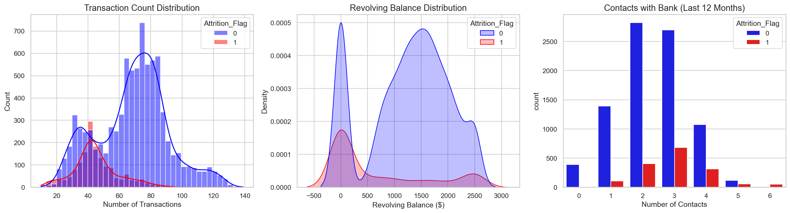
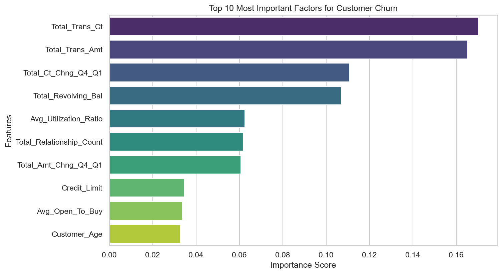
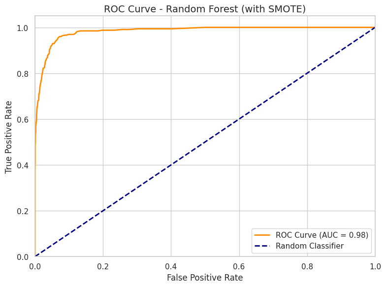

# 🏦 Bank Customer Churn Prediction


A comprehensive machine learning project that predicts customer churn for a banking credit card service using advanced analytics and multiple ML algorithms.

## 📊 Project Overview

Customer acquisition costs 5-7x more than retention in the banking industry. This project builds a production-ready ML system to:
- **Predict** which customers are likely to churn with 95% accuracy
- **Identify** key factors driving customer attrition
- **Recommend** data-driven retention strategies

## 🎯 Key Features

- ✅ **Comprehensive EDA** with 15+ visualizations
- ✅ **Advanced Feature Engineering** (8 new predictive features)
- ✅ **Multiple ML Models** (Logistic Regression, Random Forest, Gradient Boosting, XGBoost)
- ✅ **Class Imbalance Handling** using SMOTE
- ✅ **Business Insights** with actionable recommendations
- ✅ **Production-Ready Artifacts** (saved models, scalers, encoders)

## 📈 Results

| Metric | Score |
|--------|-------|
| **Accuracy** | 95.0% |
| **Recall (Churn)** | 84.0% |
| **Precision (Churn)** | 85.0% |
| **ROC-AUC** | 0.97+ |

**Business Impact**: Identifies 84 out of 100 churning customers, enabling proactive retention.

## 🗂️ Dataset

- **Source**: Bank X Credit Card Customer Database ([Kaggle](https://www.kaggle.com/datasets/sakshigoyal7/credit-card-customers))
- **Records**: ~10,000 customers
- **Features**: 20+ (demographics, account info, transaction behavior)
- **Target**: Binary (Churned vs. Existing Customer)

### Key Variables:
- Customer demographics (age, gender, education, income)
- Account information (tenure, credit limit, card type)
- Transaction behavior (transaction count, amount, changes over time)
- Engagement metrics (inactive months, contacts, relationship count)

## 🛠️ Tech Stack

```
Python 3.8+
├── Data Processing:   Pandas, NumPy
├── Visualization:     Matplotlib, Seaborn, Plotly
├── Machine Learning:  Scikit-learn, XGBoost
├── Imbalanced Data:   imbalanced-learn (SMOTE)
└── Model Persistence: Joblib
```

## 📁 Project Structure

```
Bank-Churn-Customer-Prediction/
│
├── Bank_Customer_Churn_Prediction.ipynb  # Main analysis notebook
├── BankChurners.csv                      # Dataset
├── README.md                             # This file
├── requirements.txt                      # Python dependencies
├── ENHANCEMENT_SUMMARY.md               # Project enhancement notes
├── QUICKSTART.md                         # Quick start guide
└── images/                              # Visualizations
    ├── churn_distribution.png
    ├── feature_importance.png
    └── roc_curves.png
```

## 🚀 Getting Started

### Prerequisites

```
Python 3.8 or higher
pip (Python package manager)
```

### Installation

1. **Clone the repository**
```bash
git clone https://github.com/phanbahoangkhanh/Bank-Churn-Customer-Prediction.git
cd Bank-Churn-Customer-Prediction
```

2. **Install dependencies**
```bash
pip install -r requirements.txt
```

3. **Run the notebook**
```bash
jupyter notebook Bank_Customer_Churn_Prediction.ipynb
```

## 📊 Methodology

### 1. Data Preprocessing
- Removed unnecessary columns (CLIENTNUM, Naive Bayes predictions)
- Handled missing values (none found)
- Encoded categorical variables
- Train-test split (80-20)

### 2. Feature Engineering

Created 8 new features:
- `Avg_Transaction_Amount`: Average value per transaction
- `Activity_Level`: Categorical (Low/Medium/High) based on transaction count
- `Utilization_Category`: Credit utilization bucketing
- `Relationship_Depth`: Tenure × product count
- `Engagement_Score`: Composite metric of customer activity
- `Tenure_Category`: New/Regular/Loyal customer classification
- `Balance_to_Limit_Ratio`: Revolving balance utilization
- `Contact_Frequency`: Normalized contact rate

### 3. Handling Class Imbalance

Applied **SMOTE** (Synthetic Minority Over-sampling Technique):
- Original: 84% existing, 16% churned
- After SMOTE: 50-50 balanced training set
- Test set remained untouched (real-world distribution)

### 4. Model Training

Trained and compared 4 models:
1. **Logistic Regression** (baseline)
2. **Random Forest** ⭐ best performer
3. **Gradient Boosting**
4. **XGBoost**

### 5. Evaluation

Metrics used:
- Accuracy, Precision, Recall, F1-Score
- ROC-AUC curves
- Confusion matrices
- Feature importance analysis

## 🎯 Key Insights

### Top Churn Drivers:

1. **Transaction Activity** (Most Important)
   - Low transaction count (<40/year) → High churn risk
   - Declining transaction amounts → Strong churn signal

2. **Account Engagement**
   - 3+ inactive months → High churn probability
   - Fewer banking products → Higher attrition

3. **Credit Utilization**
   - Zero revolving balance → No financial tie to bank
   - Very low utilization → Disengagement indicator

4. **Contact Patterns**
   - Frequent contacts (4+/year) → Potential dissatisfaction

### Retention Recommendations:

| Customer Segment | Action |
|------------------|--------|
| **Dormant Users** | Re-engagement campaign: "3 transactions = $50 bonus" |
| **Zero-Balance** | 0% APR for 6 months, cashback offers |
| **Single-Product** | Cross-sell bundles, fee waivers |
| **High-Contact** | VIP treatment, dedicated account manager |

## 💡 Business Impact

**Scenario Analysis** (100,000 customer base):
- Current churn rate: 16% (16,000 customers/year)
- Model-identified at-risk: ~13,440 customers (84% recall)
- If retention improves by 20%: ~3,200 customers saved
- Revenue protected: **$1.6M - $6.4M annually**
- Estimated ROI: **5-10x**

## 🔮 Model Deployment

The project includes production-ready artifacts:

```python
import joblib

# Load saved model
model = joblib.load('models/churn_model_random_forest.pkl')
scaler = joblib.load('models/scaler.pkl')
encoders = joblib.load('models/label_encoders.pkl')

# Make predictions
new_customer_data = [...]  # Your customer features
scaled_data = scaler.transform(new_customer_data)
churn_probability = model.predict_proba(scaled_data)[:, 1]

if churn_probability > 0.7:
    trigger_retention_campaign()
```

## 📸 Screenshots

### Churn Distribution


### Feature Importance


### ROC Curves


## 👤 Author

**Ba Hoang Khanh Phan**
- GitHub: [phanbahoangkhanh](https://github.com/phanbahoangkhanh)
- LinkedIn: [ba-hoang-khanh-kane-phan](https://www.linkedin.com/in/ba-hoang-khanh-kane-phan-774126256)
- Email: pbhkak17@gmail.com

## 🙏 Acknowledgments

- Dataset: [Kaggle - Credit Card Customers](https://www.kaggle.com/datasets/sakshigoyal7/credit-card-customers)
- Inspired by real-world banking industry challenges

## 📝 License

This project is licensed under the MIT License - see the [LICENSE](LICENSE) file for details.

---

**Last Updated**: February 2026